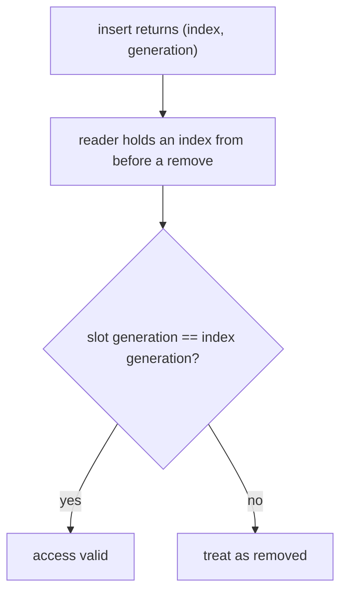

# Explain

Every explanation is a tree. The question is the root, prerequisites are the branches, and the leaves assemble into the answer. Build the tree before writing. Never answer the root while a branch is still unexplained.

## The tree

1. **Root.** Restate the question in one line, in motivation form. "Why use a generational arena" is not "what is a generational arena". The root is why the thing exists.
2. **Decompose.** Each concept the root depends on becomes a node. Decompose every node until its children are things the reader already knows.
3. **Pick the base.** Start at the lowest node the reader plausibly knows and state that assumption in one line. Do not start at absolute zero, and do not skip a prerequisite the answer needs. "You know what a Vec is. What breaks when it reallocates" is a base. "What is memory" is not.
4. **Walk bottom-up.** One section per node, one idea per node. Each section ends by naming the gap it leaves open. The next section fills it. No forward references.
5. **Assemble.** The last section answers the original question using only what the tree established. No new concept may appear at the root.

Worked tree for "why use a generational arena":

- Base: you know a Vec and a reference into it break when the Vec grows.
- Why raw indices are not enough: a stale index points at a reused slot, the ABA problem.
- What an arena is: one allocation, stable slots, index instead of pointer.
- What the generation counter adds: every slot carries a version, every index carries the version it was issued with, a stale index cannot match.
- Root: what this buys (safe removal without dangling handles) and what it costs (two words per handle, one version bump per reuse).

## Flowchart the logic

Whenever a section explains how a mechanism runs (control flow, lifecycle, data flow), draw it as one mermaid flowchart beside the prose. Nodes are decisions, states, and data movements. No decoration.

Purely conceptual sections with no flow stay prose-only.

## Walking code

For "explain this file" or "walk me through X", same tree rules, then:

1. Read the whole file first with the `Read` tool, not from memory.
2. One sentence: the file's one job.
3. Signatures grouped by lifecycle (construct, use, teardown) or by the order the API actually has.
4. Canonical usage snippet.
5. Call-stack trace with `file:line` showing what actually runs.
6. Quote real code with line numbers and annotate it. Do not paraphrase the code in prose.
7. Explain an idiom only when the reader is new to the language. Never re-teach anything inside the stated base.
8. Follow the structure the code actually has: where modules meet, where data gets converted, what is forced through one narrow point. That is the organizing idea, not the tidy layer diagram you would prefer.

## Diff mode

When asked to explain a diff, start with `git diff <base> --stat` (default base `main`) and the commit list. Summarize new files in a table. Then walk the key files one at a time with the rules above.

## Next

End every pass with two or three next nodes: a deeper branch, a sibling concept, or the file in this codebase where the idea lives. If they say "continue", take the last proposal.
