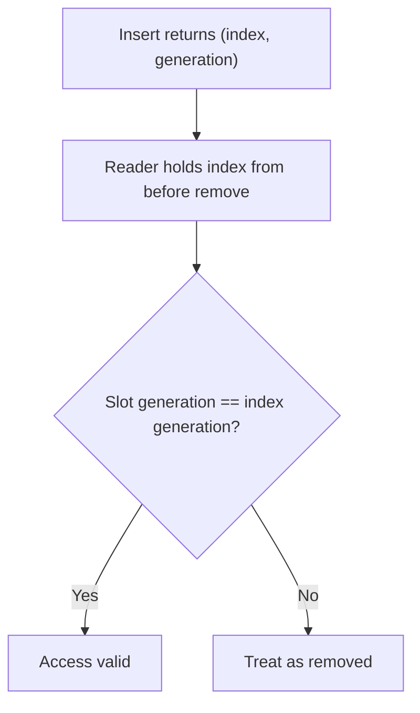
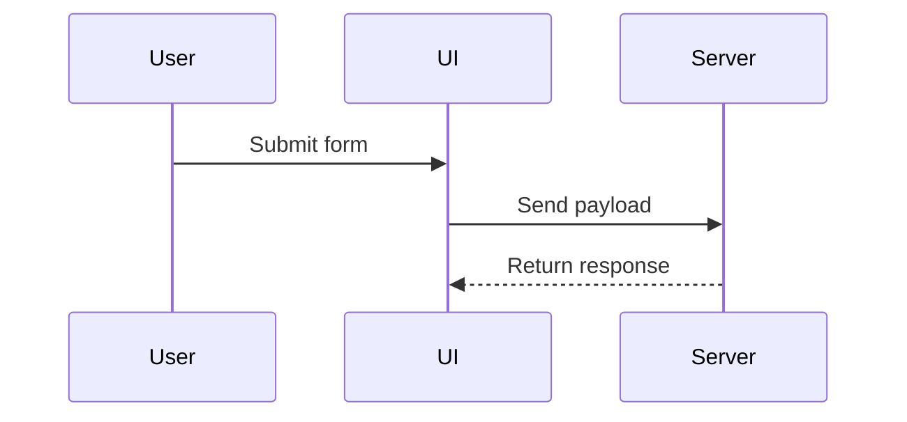

# Explain

Explain code and concepts clearly. Break complex topics into prerequisites, start with familiar basics, and build up to the answer. Use the right visual format for the subject.

## Structure

Before explaining, order the ideas like a tree from prerequisites to the final answer:

1. State the purpose. Explain what problem the concept solves or why it exists.
2. Identify prerequisites. Find the underlying ideas the reader must understand first.
3. Build step by step. Start with what the reader knows. Explain each prerequisite before moving to the next.
4. Answer the question. Connect the prerequisites to answer the core question. Do not introduce new concepts at the end.

## Visuals and examples

Choose the visual format that fits the topic. Keep visuals focused and pair them with concise text.

### Concepts and data flow: Mermaid diagrams

Use Mermaid diagrams to show flows, state machines, and interactions:
- Use `flowchart` for control flow, data flow, and lifecycles.
- Use `sequenceDiagram` for interactions between components or actors.





### Mechanisms: simplified code examples

Provide the smallest code snippet that demonstrates the idea. Cut boilerplate so the core logic stays obvious:

```typescript
// Check cache before fetching
async function getUser(id: string): Promise<User> {
  const cached = cache.get(id);
  if (cached) return cached;

  const user = await db.users.find(id);
  cache.set(id, user);
  return user;
}
```

### Proposed changes: diff sketches

Use a diff sketch when showing what changed in logic or structure:

```diff
 on(save)
-  write content
+  if content is unchanged
+    return cached result
+  write new content
+  invalidate cache
```

### UI structure: component trees

Use a component tree to show UI hierarchy, file paths, and key boundaries:

```tsx
<SessionPage> (apps/example/src/routes/session.tsx)
  useSessionEvents()
  <SessionToolbar>
    <RunSkillButton> (packages/ui)
```

### Runtime execution: call trees

Use an indented call tree to show function execution order:

```text
submitForm
  createSession
    persistPrompt
    launchAgent
  navigateToSession
```

### File layouts: file trees

Use a shallow directory tree to explain file responsibilities or proposed refactors:

```text
src/
├── commands/       # Parses user actions
├── sessions/       # Owns session state
└── transport/      # Sends API requests
```

### Dense layouts or interactive flows: HTML artifact

When a UI layout, infographic, or comparison is too dense for text or Mermaid, create a focused HTML artifact. Use realistic labels and match product colors. Use this format as an escape hatch, not the default.

## Walking code

When explaining a specific file or module:

1. Read the target files first. Never explain code from memory.
2. State the file's primary responsibility in one sentence.
3. Show the architecture or workflow with a Mermaid diagram.
4. Quote real code with file paths and line numbers. Explain why the code works that way.
5. Provide a minimal usage snippet showing how callers invoke the module.

## Explaining diffs

When explaining git changes:

1. Start with a summary of the intent and the affected files (`git diff <base> --stat`).
2. Group related changes by subsystem rather than going alphabetically.
3. Use diff sketches and call trees to show how runtime behavior changed.

## Next steps

End each explanation with two or three logical follow-ups: deeper details, related files in the repository, or next implementation steps. If the user asks to continue, take the last option.
